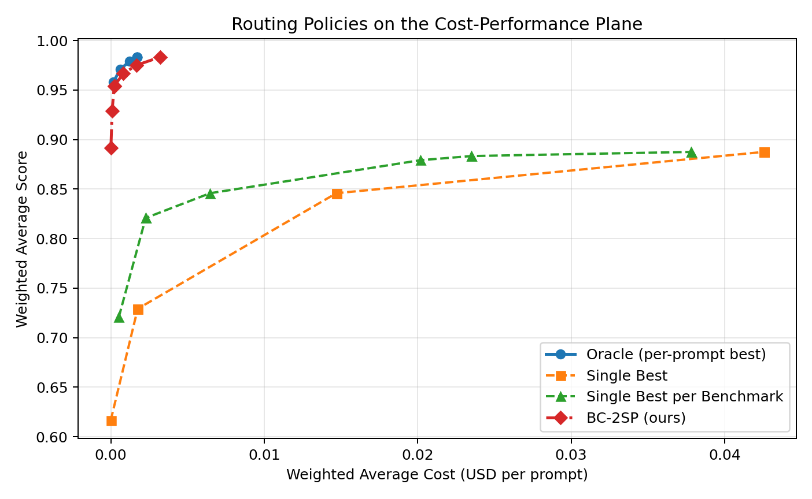
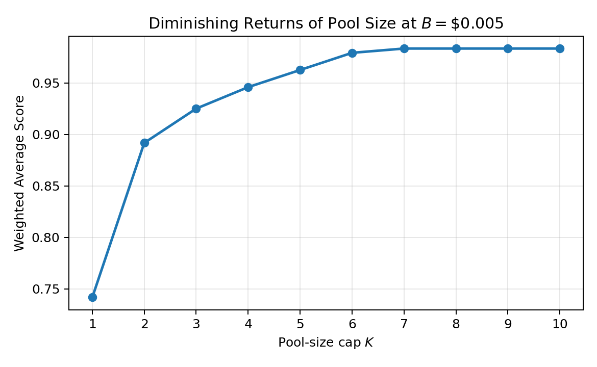
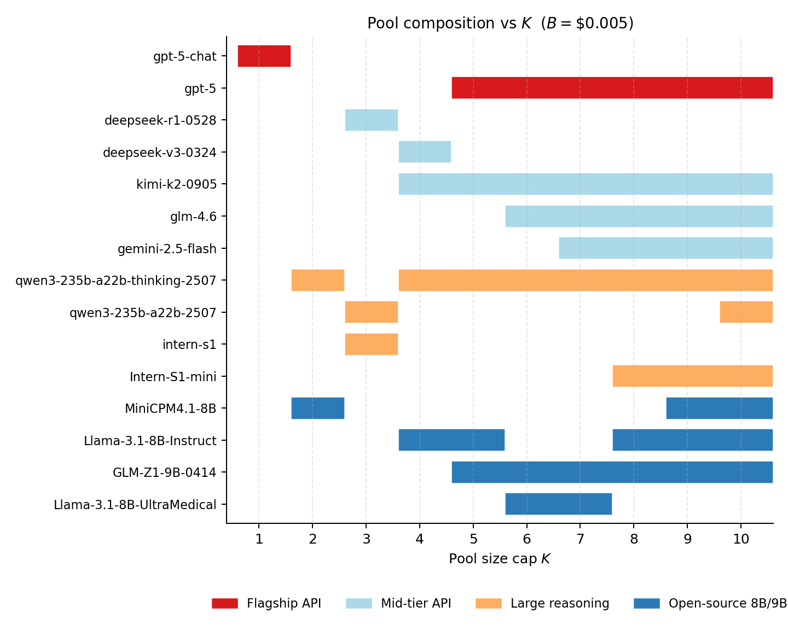
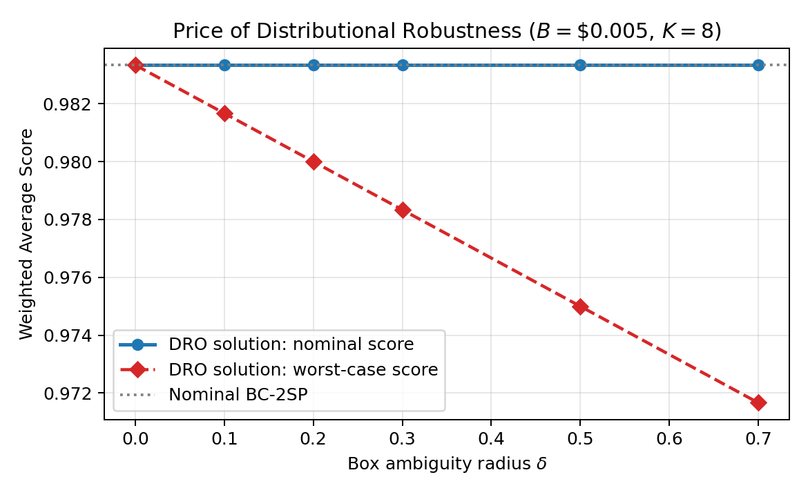

# Curating a Robust LLM Pool: A Two-Stage Stochastic Optimization Approach for Cost-Constrained LLM Routing

Berkeley INDENG 164 Final Project, Spring 2026

Jingwen Yang, Yu Hin Liang

- Code: [`submit.ipynb`](submit.ipynb)
- Report: [`report.pdf`](report.pdf)

## Headline result

| Policy | Score | Cost (\$/prompt) | Pool size |
|---|---:|---:|---:|
| Single Best (gpt-5)            | 0.8875 | 0.04255 | 1 |
| Single Best per Benchmark       | 0.8875 | 0.03782 | 4 |
| BC-2SP (ours), B = \$0.001        | 0.9667 | 0.00082 | 8 |
| **BC-2SP (ours), B = \$0.005**    | **0.9833** | **0.00323** | **8** |
| Oracle (per-prompt best)        | 0.9833 | 0.00170 | 32 |

At a budget of \$0.005 per prompt, the BC-2SP policy attains the per-prompt
oracle quality (0.983), which is **13× cheaper than running gpt-5 on every
prompt** at **9.5 percentage points higher** quality.

## Diminishing returns of pool size (RQ1)

 

Sweeping the pool cap $K$ at fixed budget $B = \$0.005$, the score rises
quickly and saturates: $K=2$ already lifts the score by 15 pp, $K=4$ reaches
0.946, and **$K=6$ captures 99.7% of the $K=10$ value**. From $K=7$ onward
the curve is pinned at the per-prompt oracle quality 0.983. The growth path
on the right shows that the optimiser first picks complementary free
open-source backbones; gpt-5 only enters at $K=4$ and ends up routing only
1.7% of traffic in the $K=8$ pool, serving as a backstop for the four
hardest prompts.

## Distributional robustness (RQ2)

Even under a $\pm 70\%$ shift in benchmark proportions, the worst-case
score of the DRO solution drops by at most **1.2 pp**, while nominal
quality stays pinned at the oracle. The DRO pool overlaps with the nominal
solution in 7 of 8 slots for $\delta \le 0.5$, so the optimal pool is
itself stable.
